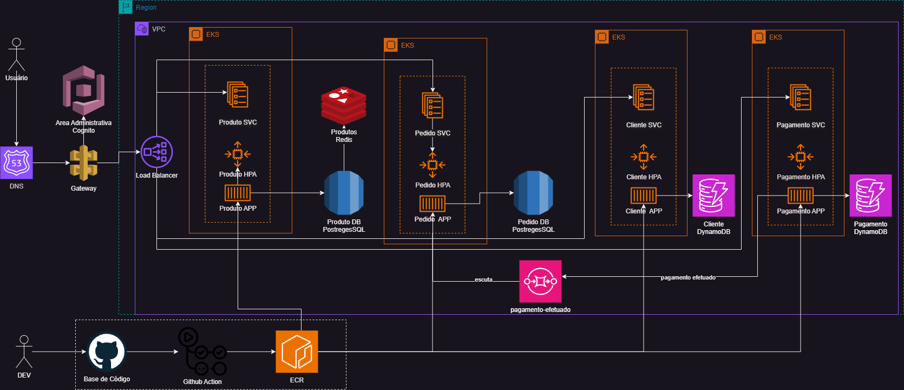

# Tech Challenge - Estabelecimento - Infra

# Índice

* [Índice](#índice)
* [Breve Descrição](#Breve-Descrição)
* [Demais repositórios](#Demais-repositórios)
* [Tecnologias Utilizadas](#Tecnologias-Utilizadas)
* [Desenho Solução](#Desenho-Solução)
* [Estrutura do Projeto](#Estrutura-do-Projeto)
* [Rodando o Projeto Local](#Rodando-o-Projeto-Local)

## Breve Descrição

Aplicação se trata de um Projeto Fiap Tech Challenge - Software Architecture, simulando um projeto de um estabelecimento
de pedidos (fast-food).

Este repositório é referente a Infra do repositório (EKS, ALB, SG, TG, SQS).

### Demais repositórios
- https://github.com/leodelmiro/tech-challenge-estabelecimento-pagamento
- https://github.com/leodelmiro/tech-challenge-estabelecimento-pedido
- https://github.com/leodelmiro/tech-challenge-estabelecimento-cliente
- https://github.com/leodelmiro/tech-challenge-estabelecimento-produto
- https://github.com/leodelmiro/tech-challenge-estabelecimento-db
- https://github.com/leodelmiro/tech-challenge-estabelecimento-lambda-authorizer
- https://github.com/leodelmiro/tech-challenge-estabelecimento-gtw

## Tecnologias Utilizadas

- Terraform
- AWS
- Kubernetes

## Desenho Solução

### Infra AWS



## Estrutura do Projeto

- .github: Arquivos com as actions.
- Desenhos: Arquivos relacionados aos desenhos do projeto.
- Infra: Arquivos terraform para criação do banco de dados.
   - terraform: Arquivos de criação do EKS e ECR.

## Rodando o Projeto Local

### 1. Pré-requisitos

Certifique-se de ter as seguintes ferramentas instaladas:

- Terraform
- AWS CLI

### 2. Clonar o Repositório

Clone o repositório do projeto:

```sh
git clone https://github.com/leodelmiro/tech-challenge-estabelecimento-infra
```

### 3. Executar o Script de Setup

O projeto inclui um script de setup (`setup.sh`) que automatiza o processo de construção e execução do projeto. O script
realiza as seguintes operações:

- 

Para executar o script, siga os passos abaixo:

#### macOS e Linux

1. **Tornar o Script Executável**:

    ```sh
    chmod +x setup.sh
    ```

2. **Executar o Script**:

    ```sh
    ./setup.sh
    ```

#### Windows

1. **Executar o Script**:

   No PowerShell ou Git Bash:

    ```sh
    ./setup.sh
    ```
